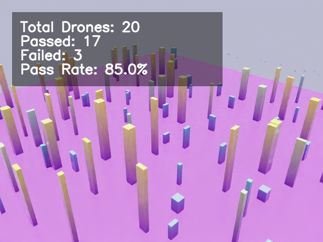
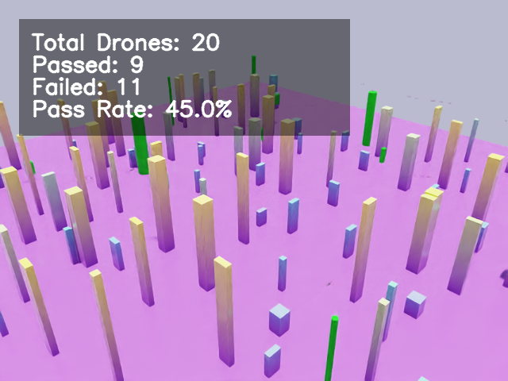
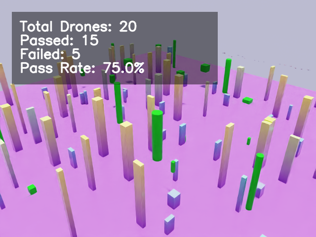
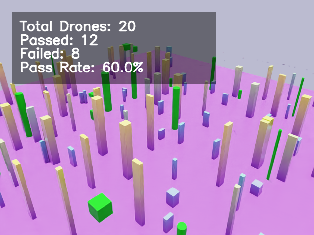

# NavRL：动态环境中的安全飞行学习
[](https://docs.python.org/3/whatsnew/3.10.html)
[](https://wiki.ros.org/noetic)
[](https://docs.ros.org/en/humble/index.html)
[](https://docs.omniverse.nvidia.com/isaacsim/latest/overview.html)
[](https://releases.ubuntu.com/22.04/)

这是一个基于开源 `NavRL` 框架整理和扩展的中文项目说明仓库，用于展示我在 `Isaac Sim` 环境下围绕四旋翼无人机强化学习动态避障所做的训练流程改进、评估脚本补充、展示素材整理与文档重构工作。

原始开源工作与论文链接保留如下：

- 原论文：[`NavRL: Learning Safe Flight in Dynamic Environments`](https://ieeexplore.ieee.org/document/10904341)
- IEEE Xplore：<https://ieeexplore.ieee.org/document/10904341>
- 预印本：<https://arxiv.org/pdf/2409.15634>
- YouTube 演示：<https://youtu.be/EbeJW8-YlvI>
- Bilibili 演示：<https://www.bilibili.com/video/BV1gsA9eTErz/?share_source=copy_web&vd_source=1333db331406abb1b5d4cece1e253427>
- 上游项目仓库：<https://github.com/Zhefan-Xu/NavRL>

<table>
  <tr>
    <td></td>
    <td></td>
    <td></td>
  </tr>
</table>

## 项目说明

这个仓库包含两部分内容：

- **上游 NavRL 原始能力**
  - 包括论文对应的训练、部署和 ROS 相关工程结构
- **我基于 `isaac-training` 子项目做的改进与整理**
  - 强化学习训练流程调整
  - 环境逻辑与奖励函数修改
  - 批量回放、统计评估与展示脚本
  - 中文说明文档、复现文档、简历/毕业设计材料整理

更准确地说，这个项目不是“从零发明一个全新的 RL 算法”，而是**基于现有 NavRL / OmniDrones 框架，对 Isaac Sim 训练链路做工程化改进与结果整理**，使其更适合：

- 实验复现
- 行为回放
- 结果统计
- README 展示
- 简历 / 面试 / 毕业设计材料整理

## 我在这个仓库中的主要工作

我主要围绕 `isaac-training` 子目录做了以下工作：

- **环境重置逻辑修改**
  - 让无人机更倾向于真正穿越障碍区，而不是沿地图边缘绕飞
- **奖励函数修正**
  - 增加姿态稳定性相关惩罚，减轻首次避障后摇晃和后续碰撞问题
- **动态障碍生成约束**
  - 对起点/终点走廊进行保护，减少不合理场景分布
- **训练与回放工作流优化**
  - 改善 checkpoint 恢复、回放脚本与展示导出流程
- **批量评估能力补充**
  - 输出 `csv/json/md` 结果文件，支持更正式的结果表达
- **项目展示材料整理**
  - 补充中文 README、复现实验文档、实习版项目说明和毕业设计版说明

## 当前重点展示内容

如果你主要关心我这次实际修改的部分，建议优先查看：

- [`isaac-training/README_CN.md`](isaac-training/README_CN.md)
- [`isaac-training/INTERNSHIP_PROJECT_CN.md`](isaac-training/INTERNSHIP_PROJECT_CN.md)
- [`isaac-training/GRADUATION_DESIGN_CN.md`](isaac-training/GRADUATION_DESIGN_CN.md)
- [`isaac-training/REPRODUCIBILITY_CN.md`](isaac-training/REPRODUCIBILITY_CN.md)
- [`isaac-training/PROJECT_BOUNDARY_CN.md`](isaac-training/PROJECT_BOUNDARY_CN.md)

其中：

- **`README_CN.md`** 适合作为项目总览
- **`INTERNSHIP_PROJECT_CN.md`** 适合简历和面试表达
- **`GRADUATION_DESIGN_CN.md`** 适合毕业设计 / 答辩材料整理
- **`REPRODUCIBILITY_CN.md`** 适合说明如何复现实验与展示素材
- **`PROJECT_BOUNDARY_CN.md`** 适合说明个人贡献边界，避免夸大表述

## 当前可展示结果

在 `isaac-training` 子项目中，我已经整理出以下代表性展示材料：

### 代表性截图

- 
- 
- 
- 

### 代表性统计结果

- [`isaac-training/media/results/static_120_summary.md`](isaac-training/media/results/static_120_summary.md)
- [`isaac-training/media/results/dynamic_120_16_summary.md`](isaac-training/media/results/dynamic_120_16_summary.md)
- [`isaac-training/media/results/dynamic_100_32_summary.md`](isaac-training/media/results/dynamic_100_32_summary.md)
- [`isaac-training/media/results/dynamic_120_32_summary.md`](isaac-training/media/results/dynamic_120_32_summary.md)

### 当前可对外表达的结果结论

基于当前已整理出的实验记录与展示材料，可以较稳妥地表达为：

- 纯静态高密度障碍场景下，策略已具备较稳定穿越能力
- 引入动态障碍后，成功率会明显受姿态稳定性和扰动恢复能力影响
- 在代表性的 `120` 个静态障碍 + `32` 个动态障碍混合场景中，已经整理出可展示视频、截图和批量统计结果
- 对外表述时应区分：
  - **`showcase pass`**：更适合视频/截图展示
  - **`evaluation success`**：更适合正式结果统计、论文或答辩表述

## 仓库结构建议阅读顺序

### 如果你想了解原始开源项目

优先看：

- 原论文与视频链接
- 下方“原始开源能力说明”部分
- `ros1/` 与 `ros2/` 目录
- `quick-demos/` 目录

### 如果你想了解我的修改与项目展示部分

优先看：

- `isaac-training/README_CN.md`
- `isaac-training/training/scripts/env.py`
- `isaac-training/training/scripts/train.py`
- `isaac-training/training/scripts/evaluate_case_stats.py`
- `isaac-training/training/scripts/export_demo_video.py`
- `isaac-training/capture_demo_videos.sh`
- `isaac-training/evaluate_demo_cases.sh`

## 快速入口

### 1. 查看中文项目说明

```bash
xdg-open /home/p/CascadeProjects/NavRL/isaac-training/README_CN.md
```

### 2. 训练入口

```bash
bash /home/p/CascadeProjects/NavRL/isaac-training/train.sh
```

### 3. 回放入口

```bash
bash /home/p/CascadeProjects/NavRL/isaac-training/back.sh
```

### 4. 批量导出展示素材

```bash
bash /home/p/CascadeProjects/NavRL/isaac-training/capture_demo_videos.sh static_120_success
bash /home/p/CascadeProjects/NavRL/isaac-training/capture_demo_videos.sh dynamic_120_16_failure_analysis
bash /home/p/CascadeProjects/NavRL/isaac-training/capture_demo_videos.sh dynamic_100_32_stress
bash /home/p/CascadeProjects/NavRL/isaac-training/capture_demo_videos.sh dynamic_120_32_success
```

### 5. 批量统计结果

```bash
bash /home/p/CascadeProjects/NavRL/isaac-training/evaluate_demo_cases.sh static_120
bash /home/p/CascadeProjects/NavRL/isaac-training/evaluate_demo_cases.sh dynamic_120_16
bash /home/p/CascadeProjects/NavRL/isaac-training/evaluate_demo_cases.sh dynamic_100_32
bash /home/p/CascadeProjects/NavRL/isaac-training/evaluate_demo_cases.sh dynamic_120_32
```

## 原始开源能力说明

以下内容主要对应上游 NavRL 仓库原本提供的能力，我在这里保留核心链接与入口，便于读者继续追溯原始工作。

## NavRL 三分钟快速演示

上游项目提供了预训练模型和快速运行脚本，用于快速体验 NavRL 框架。

<table>
  <tr>
    <td></td>
    <td></td>
    <td></td>
  </tr>
</table>

完成环境配置后，可通过以下命令运行快速演示：

```bash
conda activate NavRL
cd quick-demos

# DEMO I: 飞向预定义目标点
python simple-navigation.py

# DEMO II: 飞向动态/随机目标点
python random-navigation.py

# DEMO III: 多机器人导航
python multi-robot-navigation.py
```

## I. 在 NVIDIA Isaac Sim 中训练

这一部分对应上游训练说明，适合希望从头运行 NavRL 训练链路的读者。

### Isaac Sim 安装说明

上游项目原始说明基于 **Isaac Sim 2023.1.0-hotfix.1**。如果你希望严格按论文对应版本复现，请优先参考原始环境要求。

原 README 中的说明要点包括：

- 使用指定 Isaac Sim 版本
- 先完成 Docker 容器环境准备
- 再将 Isaac Sim 内容复制到本地目录

你也可以直接参考官方文档：

- Isaac Sim 安装文档：<https://docs.omniverse.nvidia.com/isaacsim/latest/overview.html>
- 容器安装说明：<https://docs.isaacsim.omniverse.nvidia.com/latest/installation/install_container.html>

### NavRL 训练环境搭建

```bash
cd NavRL/isaac-training
bash setup.sh
```

完成后应创建名为 `NavRL` 的 Conda 环境。

### 验证训练示例

```bash
conda activate NavRL
python training/scripts/train.py
```

## II. 部署环境

如果你只希望运行部署或演示而不自己训练，可使用上游提供的部署环境配置：

```bash
cd NavRL/isaac-training
bash setup_deployment.sh
```

## III. ROS1 部署

上游仓库包含基于 ROS1 + Gazebo 的四旋翼部署示例，适用环境：

- Ubuntu 20.04 LTS
- ROS1 Noetic

更多细节请继续查看仓库中的 `ros1/` 目录与原始脚本说明。

## IV. ROS2 部署

上游仓库也包含基于 ROS2 + Isaac Sim 的部署示例，适用环境：

- Ubuntu 22.04 LTS
- ROS2 Humble

更多细节请继续查看仓库中的 `ros2/` 目录与原始脚本说明。

## 引用信息

如果原始 NavRL 工作对你的研究有帮助，请优先引用原论文：

```bibtex
@ARTICLE{NavRL,
  author={Xu, Zhefan and Han, Xinming and Shen, Haoyu and Jin, Hanyu and Shimada, Kenji},
  journal={IEEE Robotics and Automation Letters},
  title={NavRL: Learning Safe Flight in Dynamic Environments},
  year={2025},
  volume={10},
  number={4},
  pages={3668-3675},
  keywords={Navigation;Robots;Collision avoidance;Training;Safety;Vehicle dynamics;Heuristic algorithms;Detectors;Autonomous aerial vehicles;Learning systems;Aerial systems: Perception and autonomy;reinforcement learning;collision avoidance},
  doi={10.1109/LRA.2025.3546069}
}
```

## 致谢

- 原始 NavRL 工作作者：Zhefan Xu, Xinming Han, Haoyu Shen, Hanyu Jin, Kenji Shimada
- 上游 Isaac Sim 训练部分构建于 [`OmniDrones`](https://github.com/btx0424/OmniDrones)
- 本仓库中的中文整理、实验展示材料与 Isaac-training 相关改动，为我基于开源项目所做的二次工程化整理
